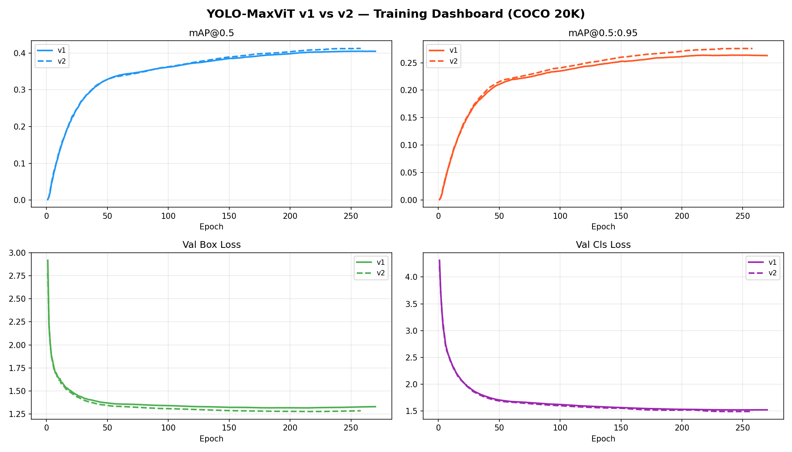
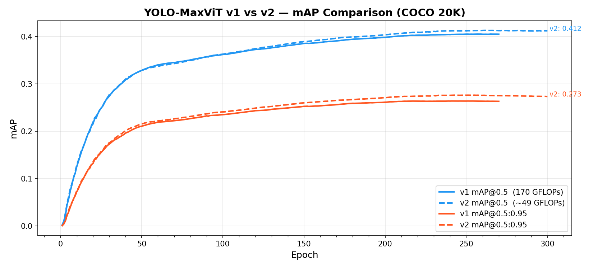
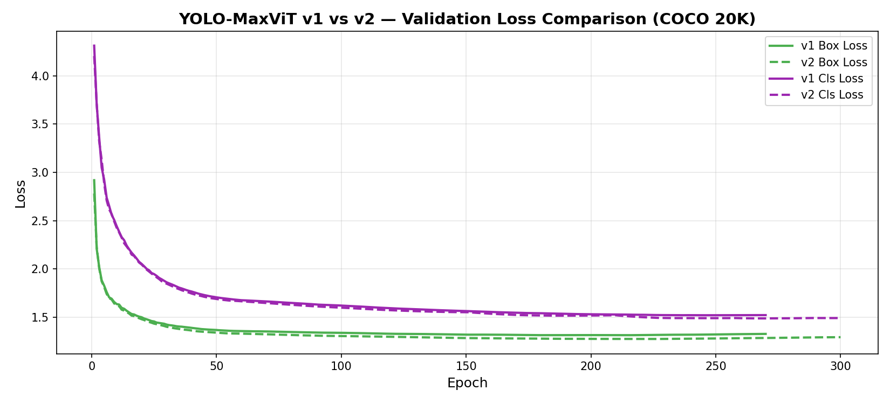

# YOLO-MaxViT

**Hybrid CNN–Transformer Object Detection via MaxViT Backbone and C3TR Neck integrated into YOLOv11**

[](LICENSE)
[](https://www.python.org/)
[](https://github.com/ultralytics/ultralytics)
[]()

> ✅ **Training complete** — 300/300 epochs on COCO 2017 20K subset. Latest model: **YOLO-MaxViT v2** — mAP@0.5 = **0.413**, GFLOPs = **49.3** (3.46× more efficient than v1).

---

## Overview

YOLO-MaxViT is a research project that integrates **Multi-Axis Vision Transformer (MaxViT)** attention into the YOLOv11 detection backbone, combined with **C3TR transformer blocks** in the detection neck. The goal is to evaluate whether hybrid CNN–Transformer architectures can improve detection accuracy over vanilla YOLOv11n while remaining in a comparable parameter budget.

This repository contains the full modified [Ultralytics YOLOv11](https://github.com/ultralytics/ultralytics) codebase, two custom architecture variants (v1 and v2), training scripts, and complete results on a 20K-image COCO 2017 subset.

> The latest and recommended model is **v2** (`yolov11C3TR_v2`) — it achieves **higher mAP at 3.46× lower compute** than v1.

---

## Table of Contents

- [Architecture — v2 (Latest)](#architecture--v2-optimized)
- [Architecture — v1 (Reference)](#architecture)
- [Key Files](#key-files)
- [Getting Started](#getting-started)
- [Results](#results--v2-final-evaluation)
- [v1 vs v2 Comparison](#v1-vs-v2-comparison)
- [Comparison with YOLO11 Family](#comparison-with-yolo11-family)
- [Training Environment](#training-environment)
- [References](#references)
- [License](#license)

---

## Architecture — v1 (Reference)

### Model: `yolov11C3TR`

The architecture replaces standard convolutions at deeper backbone stages with `MaxViTCNNBlock` (multi-axis window + grid attention), and uses `C3TR` transformer blocks in the neck at the two largest feature scales.

```
Backbone
────────────────────────────────────────────────────────────────
Conv → Conv → C2f → Conv → C2f
  → Conv → MaxViTCNNBlock  (512ch,  window 16×16)  ← Local + Global Attention
  → Conv → MaxViTCNNBlock  (1024ch, window 8×8)    ← Local + Global Attention
  → SPPF → C2PSA

Detection Neck
────────────────────────────────────────────────────────────────
Upsample → Concat → C3k2  (256ch,  P3 small scale)   ← CNN
Upsample → Concat → C3k2  (512ch,  P4 mid scale)     ← CNN
Downsample → Concat → C3TR (512ch,  P4 large scale)   ← Transformer
Downsample → Concat → C3TR (1024ch, P5 largest scale) ← Transformer

Detection Head: [P3, P4, P5]
```

**Design rationale**: Small-scale feature maps (P3) use efficient local CNN (`C3k2`) since fine-grained spatial detail matters more than global context. Large-scale feature maps (P4, P5) use `C3TR` to leverage global semantic context for detecting larger objects.

### Model Properties

| Property | Value |
|---|---|
| Parameters | 4.89M |
| GFLOPs | 170.5 |
| Input size | 640 × 640 |
| Classes (COCO) | 80 |
| Architecture layers | 303 |

> **Note on GFLOPs**: The high compute cost (170.5 GFLOPs) relative to parameter count (4.9M) is characteristic of transformer attention — the multi-axis attention passes in `MaxViTCNNBlock` are computationally intensive despite adding few learnable weights.

---

## Architecture — v2 (Latest)

### Model: `yolov11C3TR_v2`

v2 is the **recommended model** — compute-optimized with smaller MaxViT attention windows and a CNN block replacing the redundant mid-scale neck transformer, achieving **3.46× fewer GFLOPs** and **higher mAP** than v1.

```
Backbone
—————————————————————————————————————————————————————————
Conv → Conv → C2f → Conv → C2f
  → Conv → MaxViTCNNBlock  (512ch,  window 8×8)   ← 🔻Shrunk from 16×16
  → Conv → MaxViTCNNBlock  (1024ch, window 4×4)   ← 🔻Shrunk from 8×8
  → SPPF → C2PSA

Detection Neck
—————————————————————————————————————————————————————————
Upsample → Concat → C3k2  (256ch, P3 small scale) ← CNN
Upsample → Concat → C3k2  (512ch, P4 mid scale)   ← CNN (was C3TR in v1) 🔻
Downsample → Concat → C3TR (512ch, P4 large scale)  ← Transformer
Downsample → Concat → C3TR (1024ch, P5 largest)    ← Transformer (kept)

Detection Head: [P3, P4, P5]
```

### v1 vs v2 Architecture Changes

| Aspect | v1 | v2 | Impact |
|---|---|---|---|
| **MaxViT window @ 512ch** | [16×16] (256 tokens) | [8×8] (64 tokens) | **16× cheaper attention** |
| **MaxViT window @ 1024ch** | [8×8] (64 tokens) | [4×4] (16 tokens) | **16× cheaper attention** |
| **Neck P4 block** | C3TR (Transformer) | C3k2 (CNN) | Removes redundant mid-scale transformer |
| **Neck P5 block** | C3TR (Transformer) | C3TR (Transformer) | Kept — global context essential at largest scale |

### v2 Model Properties

| Property | v1 | v2 | Change |
|---|---|---|---|
| Parameters | 4,890,000 | **4,893,952** | +3,952 |
| Gradients | — | **4,893,936** | — |
| Layers | 303 | **297** | −6 |
| GFLOPs | 170.5 | **49.3** | **−71.1% (−3.46×)** |
| Input size | 640×640 | 640×640 | — |
| Classes (COCO) | 80 | 80 | — |

---

## Key Files

| File | Description |
|---|---|
| `ultralytics/nn/MaxViT.py` | `MaxViTCNNBlock` implementation — multi-axis local window + grid attention |
| `ultralytics/cfg/models/11/yolov11C3TR.yaml` | v1 model architecture YAML (170.5 GFLOPs) |
| `ultralytics/cfg/models/11/yolov11C3TR_v2.yaml` | v2 optimized architecture YAML (49.3 GFLOPs) |
| `ultralytics/cfg/datasets/coco20k.yaml` | COCO 2017 20K-image subset dataset config |
| `train_custom.py` | Training entry point with all hyperparameters |
| `plot_results.py` | Generates v1 training curve plots from `results.csv` |
| `plot_compare.py` | Generates v1 vs v2 side-by-side comparison plots |
| `results/` | Training plots and comparison charts committed to repo |

> **📌 Note on naming**: The architecture YAML files are named `yolov11C3TR` after the **C3TR transformer blocks** used in the detection neck. However, the primary novel contribution of this project is the **MaxViT backbone integration** (`MaxViTCNNBlock`). The project is therefore branded as **YOLO-MaxViT** — C3TR is a supporting component, not the headline feature.

---

## Getting Started

### 1. Clone & Install

```bash
git clone https://github.com/TurjoRahman-afk/YOLO_MaxViT.git
cd YOLO_MaxViT
pip install -e .
```

### 2. Prepare Dataset

This project was trained on a 20K-image subset of **COCO 2017**.

```
datasets/coco/images/train2017/   ← training images
datasets/coco/labels/train2017/   ← training labels
datasets/coco/images/val2017/     ← validation images
```

The `train20k.txt` file (not included — dataset is gitignored) lists 20,000 image paths sampled from `train2017`. To recreate:

```powershell
# PowerShell — take first 20K lines from train2017.txt
Get-Content datasets/coco/train2017.txt | Select-Object -First 20000 | Set-Content datasets/coco/train20k.txt
```

To train on the **full COCO 2017** dataset instead, change `DATASET` in `train_custom.py` to `"ultralytics/cfg/datasets/coco.yaml"`.

### 3. Train from Scratch

```bash
python train_custom.py
```

Key hyperparameters in `train_custom.py`:

```python
DATASET    = "ultralytics/cfg/datasets/coco20k.yaml"
EPOCHS     = 300
IMGSZ      = 640
BATCH      = 16
OPTIMIZER  = "SGD"
LR0        = 0.01
AMP        = True    # Mixed precision (FP16)
COS_LR     = True    # Cosine LR schedule
RESUME     = False
```

### 4. Resume an Interrupted Run

Set `RESUME = True` in `train_custom.py` — it will continue from `weights/last.pt` automatically.

### 5. Run Inference

```python
from ultralytics import YOLO

# Recommended: use v2 (best accuracy + efficiency)
model = YOLO("runs/research/yolov11_C3TR_MaxViT_v2_coco20k/weights/best.pt")
results = model("path/to/image.jpg")
results[0].show()
```

---

## Results

> ✅ **Training complete** — 300/300 epochs on COCO 2017 20K subset.
> Best weights saved at **epoch 263** (`runs/research/yolov11_C3TR_MaxViT_v2_coco20k/weights/best.pt`).

### v2 Training Progress

| Epoch | mAP@0.5 | mAP@0.5:0.95 | Box Loss | Cls Loss |
|---|---|---|---|---|
| 1 | 0.002 | 0.001 | 3.371 | 4.983 |
| 30 | 0.277 | 0.176 | 1.406 | 2.136 |
| 60 | 0.337 | 0.222 | 1.331 | 1.890 |
| 90 | 0.357 | 0.237 | 1.281 | 1.721 |
| 120 | 0.374 | 0.249 | 1.259 | 1.659 |
| 150 | 0.389 | 0.260 | 1.216 | 1.530 |
| 180 | 0.399 | 0.267 | 1.189 | 1.462 |
| 210 | 0.407 | 0.273 | 1.155 | 1.349 |
| 240 | 0.412 | 0.276 | 1.119 | 1.278 |
| **270** | **0.412** | **0.275** | **1.090** | **1.219** |
| 300 | 0.412 | 0.273 | 1.107 | 1.099 |

### 📊 Best Checkpoint Metrics (Epoch 263)

| Metric | **v2 (Ours)** | v1 (Original) | YOLO11n (Baseline) |
|---|---|---|---|
| **mAP@0.5** | **0.4129** | 0.405 | 0.395 |
| **mAP@0.5:0.95** | **0.2756** | 0.263 | — |
| **Precision** | **0.5362** | — | — |
| **Recall** | **0.4019** | — | — |
| **F1 Score** | **0.459** | — | — |
| GFLOPs | **49.3** | 170.5 | 6.5 |
| Parameters | 4,893,952 | 4,890,000 | ~2.6M |
| Layers | 297 | 303 | — |

> F1 = 2 × Precision × Recall / (Precision + Recall) = **0.459**

### 📉 Loss Summary (Best Epoch 263)

| Loss | Training | Validation |
|---|---|---|
| **Box Loss** | 1.0958 | 1.2847 |
| **Cls Loss** | 1.2304 | 1.4896 |
| **DFL Loss** | 1.2127 | 1.3358 |

### 📈 v2 Evaluation Curves

<table>
  <tr>
    <td></td>
    <td></td>
  </tr>
  <tr>
    <td align="center"><b>Precision–Recall Curve</b></td>
    <td align="center"><b>F1–Confidence Curve</b></td>
  </tr>
  <tr>
    <td></td>
    <td></td>
  </tr>
  <tr>
    <td align="center"><b>Precision–Confidence Curve</b></td>
    <td align="center"><b>Recall–Confidence Curve</b></td>
  </tr>
</table>

### 🗂️ v2 Confusion Matrix

<table>
  <tr>
    <td></td>
    <td></td>
  </tr>
  <tr>
    <td align="center"><b>Confusion Matrix (Raw)</b></td>
    <td align="center"><b>Confusion Matrix (Normalized)</b></td>
  </tr>
</table>

### 🔍 v2 Sample Predictions

<table>
  <tr>
    <td></td>
    <td></td>
  </tr>
  <tr>
    <td align="center"><b>Ground Truth</b></td>
    <td align="center"><b>Predictions</b></td>
  </tr>
</table>

---

## v1 vs v2 Comparison

> Both models fully trained — 300/300 epochs on COCO 2017 20K subset.

### Side-by-Side mAP at Every 30 Epochs

| Epoch | v1 mAP@0.5 | v2 mAP@0.5 | v1 mAP50-95 | v2 mAP50-95 |
|---|---|---|---|---|
| 1 | 0.001 | 0.002 | 0.000 | 0.001 |
| 30 | 0.274 | 0.277 | 0.173 | 0.176 |
| 60 | 0.340 | 0.337 | 0.219 | 0.222 |
| 90 | 0.358 | 0.357 | 0.232 | 0.237 |
| 120 | 0.372 | 0.374 | 0.243 | 0.249 |
| 150 | 0.385 | 0.389 | 0.253 | 0.260 |
| 180 | 0.394 | 0.399 | 0.259 | 0.267 |
| 210 | 0.401 | 0.407 | 0.263 | 0.273 |
| 240 | 0.404 | 0.412 | 0.264 | 0.276 |
| 270 | 0.405 | **0.412** | 0.263 | **0.275** |
| 300 | 0.405 | 0.412 | 0.263 | 0.273 |

> v2 leads v1 from epoch 90 onward at every single checkpoint.

### Training Curve Comparison

<table>
  <tr>
    <td></td>
    <td></td>
    <td></td>
  </tr>
  <tr>
    <td align="center"><b>Dashboard</b></td>
    <td align="center"><b>mAP Comparison</b></td>
    <td align="center"><b>Loss Comparison</b></td>
  </tr>
</table>

> Solid lines = v1 (170.5 GFLOPs) — Dashed lines = v2 (~49 GFLOPs)

### 💡 Key Findings

| Finding | Detail |
|---|---|
| v2 accuracy vs v1 | **+0.008 mAP@0.5** (+1.9%) |
| v2 compute vs v1 | **−121.2 GFLOPs** (3.46× reduction) |
| Best v2 epoch | Epoch 263 / 300 |
| Precision (v2) | 0.5362 — clean detections |
| Recall (v2) | 0.4019 — room to improve with more data |
| F1 (v2) | 0.459 |

Shrinking MaxViT attention windows and replacing the mid-scale P4 transformer with a CNN not only reduced compute but slightly **improved generalization** — likely due to reduced over-parameterization at mid-level features.

---

## Comparison with YOLO11 Family

> ⚠️ **This is not a fair direct comparison.** Official YOLO11 models are pretrained on the **full COCO 2017 train set (118,287 images)**. YOLO-MaxViT was trained on a **20K-image subset (~17% of full COCO)**. The table below is provided for scale reference only.

| Model | Train Images | mAP@0.5:0.95 | Params (M) | GFLOPs |
|---|---|---|---|---|
| YOLO11n | 118K | 0.395 | 2.6 | 6.5 |
| YOLO11s | 118K | 0.470 | 9.4 | 21.5 |
| YOLO11m | 118K | 0.515 | 20.1 | 68.0 |
| YOLO11l | 118K | 0.534 | 25.3 | 86.9 |
| YOLO11x | 118K | 0.547 | 56.9 | 194.9 |
| **YOLO-MaxViT v1 (ours)** | **20K** | **0.263** | **4.9** | **170.5** |
| **YOLO-MaxViT v2 (ours)** | **20K** | **0.276** | **4.89M** | **49.3** |

**Key observations:**

- With only 17% of the training data, YOLO-MaxViT v2 reaches mAP@0.5:0.95 = **0.276** — within ~0.12 of YOLO11n trained on 6× more images
- By **parameter count** (4.89M), it sits between YOLO11n (2.6M) and YOLO11s (9.4M) — a nano-to-small scale model
- By **compute cost** (49.3 GFLOPs), v2 is now comparable to **YOLO11s** — a major improvement over v1's 170.5 GFLOPs
- Training on the full COCO 118K dataset is expected to significantly close the mAP gap, potentially reaching **mAP@0.5:0.95 ≈ 0.40–0.44**

---

## Training Environment

| Component | Specification |
|---|---|
| GPU | NVIDIA RTX 5060 8 GB |
| VRAM utilization | ~6–7 GB (batch=16, AMP enabled) |
| OS | Windows 11 |
| Framework | Ultralytics YOLOv11 (custom fork) |
| Python | 3.10+ |
| Approx. epoch time | ~5–6 min (20K subset) |
| Total training time | ~30 hours |

---

## References

- [Ultralytics YOLOv11](https://github.com/ultralytics/ultralytics) — base framework
- [MaxViT: Multi-Axis Vision Transformer](https://arxiv.org/abs/2204.01697) — Tu et al., NeurIPS 2022
- [Swin Transformer](https://arxiv.org/abs/2103.14030) — Liu et al., ICCV 2021
- [COCO Dataset](https://cocodataset.org) — Lin et al., ECCV 2014

---

## License

This project is built on top of [Ultralytics YOLOv11](https://github.com/ultralytics/ultralytics), which is licensed under **AGPL-3.0**. All custom modifications in this repository fall under the same license. See [LICENSE](LICENSE) for full details.

---

<p align="center">
  <i>Built as a research experiment in hybrid CNN–Transformer object detection.</i>
</p>

---


