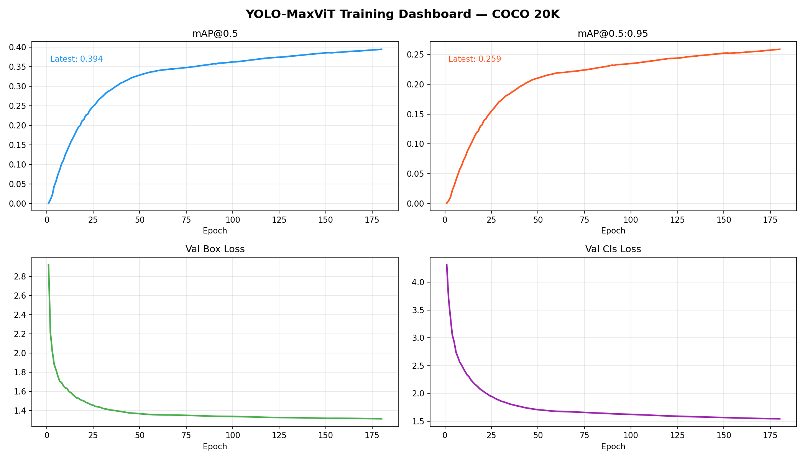
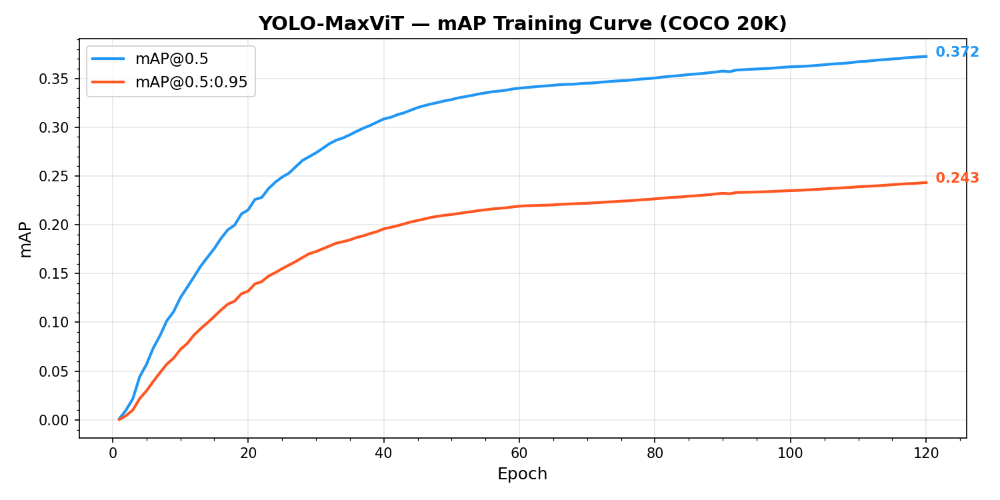
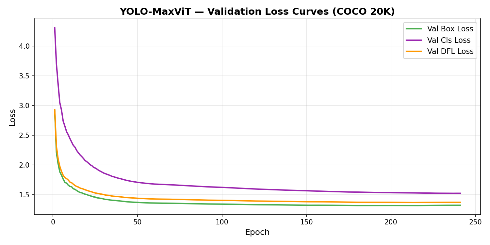

# YOLO-MaxViT: YOLOv11 with MaxViT Backbone + C3TR Transformer Neck

> A research project integrating **Multi-Axis Vision Transformer (MaxViT)** attention blocks into the **YOLOv11** object detection framework, combined with a **C3TR transformer neck** for enhanced multi-scale feature learning.

---

## 📌 What This Project Is

This project modifies the [Ultralytics YOLOv11](https://github.com/ultralytics/ultralytics) framework to replace parts of the standard CNN backbone and neck with transformer-based attention mechanisms:

- The **backbone** uses `MaxViTCNNBlock` at deeper feature scales (replacing plain convolutions) to capture both local and global context
- The **neck** uses `C3TR` transformer blocks at larger scales for richer feature aggregation
- Smaller/faster feature levels keep `C3k2` (local CNN) for efficiency

The goal is to test whether hybrid CNN–Transformer architectures improve detection accuracy (mAP) on COCO benchmarks compared to vanilla YOLOv11n.

---

## 🏗️ Architecture

### Model: `yolov11C3TR`

```
Backbone:
  Conv → Conv → C2f → Conv → C2f
  → Conv → MaxViTCNNBlock (512ch, 16×16 window)   ← Transformer
  → Conv → MaxViTCNNBlock (1024ch, 8×8 window)    ← Transformer
  → SPPF → C2PSA

Neck + Head:
  Upsample → Concat → C3k2 (256, small scale, CNN)
  Upsample → Concat → C3k2 (512, mid scale, CNN)
  Downsample → Concat → C3TR (512, large scale, Transformer)   ← Transformer
  Downsample → Concat → C3TR (1024, largest scale, Transformer) ← Transformer

Detection Head: multi-scale [P3, P4, P5]
```

| Property | Value |
|---|---|
| Parameters | ~4.9M |
| Input size | 640 × 640 |
| Classes (COCO) | 80 |
| Inference (CPU) | ~113ms |

### Key Files (Custom Contributions)

| File | Description |
|---|---|
| `ultralytics/nn/MaxViT.py` | MaxViT block implementation (multi-axis attention) |
| `ultralytics/cfg/models/11/yolov11C3TR.yaml` | Custom model architecture config |
| `ultralytics/cfg/datasets/coco20k.yaml` | COCO 2017 20K subset config |
| `train_custom.py` | Full training script with all hyperparameters |

---

## 🚀 Getting Started

### 1. Clone & Install

```bash
git clone https://github.com/TurjoRahman-afk/YOLO_MaxViT.git
cd YOLO_MaxViT
pip install -e .
```

### 2. Prepare Dataset

This project trains on **COCO 2017** (or a 20K subset for faster iteration).

Download COCO 2017:
```bash
# Images (~19 GB) — place under datasets/coco/images/
# Labels — place under datasets/coco/labels/
# Or let Ultralytics auto-download via coco.yaml
```

To use the 20K subset (recommended for experimentation):
- `train20k.txt` should list 20,000 image paths from `train2017`
- Config: `ultralytics/cfg/datasets/coco20k.yaml`

### 3. Train

```bash
python train_custom.py
```

Key hyperparameters in `train_custom.py`:

```python
DATASET       = "ultralytics/cfg/datasets/coco20k.yaml"
EPOCHS        = 300
IMGSZ         = 640
BATCH         = 16
OPTIMIZER     = "SGD"
LR0           = 0.01
AMP           = True   # mixed precision
```

### 4. Resume Training

Set `RESUME = True` in `train_custom.py` to continue from `last.pt`.

---

## 📊 Results

> ⏳ Training in progress (240/300 epochs complete) — table will be updated as training continues.

### Current Best Checkpoint

| Model | Dataset | Epochs Run | mAP@0.5 | mAP@0.5:0.95 | Status |
|---|---|---|---|---|---|
| YOLOv11n (baseline) | COCO 2017 | 300 | 0.516 | 0.386 | Reference |
| **YOLO-MaxViT (ours)** | COCO 20K subset | 240 / 300 | **0.404** | **0.264** | 🔄 In Progress |

### Training Progress

| Epoch | mAP@0.5 | mAP@0.5:0.95 | Box Loss | Cls Loss |
|---|---|---|---|---|
| 1 | 0.001 | 0.000 | 3.363 | 4.999 |
| 30 | 0.274 | 0.173 | 1.423 | 2.150 |
| 60 | 0.340 | 0.219 | 1.343 | 1.878 |
| 90 | 0.358 | 0.232 | 1.307 | 1.767 |
| 120 | 0.372 | 0.243 | 1.282 | 1.691 |
| 150 | 0.385 | 0.253 | 1.257 | 1.619 |
| 180 | 0.394 | 0.259 | 1.228 | 1.538 |
| 210 | 0.401 | 0.263 | 1.200 | 1.460 |
| **240** | **0.404** | **0.264** | **1.172** | **1.385** |

### Training Curves

<table>
  <tr>
    <td></td>
    <td></td>
    <td></td>
  </tr>
  <tr>
    <td align="center">Dashboard</td>
    <td align="center">mAP Curve</td>
    <td align="center">Loss Curve</td>
  </tr>
</table>

### Training Details
- **Dataset**: COCO 2017 — 20,000 train images / 5,000 val images (80 classes)
- **Hardware**: NVIDIA RTX 5060 8 GB
- **Batch size**: 16 with AMP (mixed precision)
- **~Epoch time**: 5–6 minutes
- **Saved checkpoints**: `epoch0.pt`, `epoch30.pt`, `epoch60.pt`, `epoch90.pt`, `best.pt`, `last.pt`

> 📌 Note: Trained on 20K subset (~17% of full COCO). Expected mAP@0.5 on full COCO 2017 with 300 epochs: ~0.45–0.50

---

## ⚙️ Training Environment

| Component | Spec |
|---|---|
| GPU | NVIDIA RTX 5060 8 GB |
| VRAM used | ~6–7 GB (batch=16, AMP) |
| OS | Windows 11 |
| Framework | Ultralytics YOLOv11 (modified) |
| Python | 3.x |
| ~Epoch time | ~5–6 min (20K subset) |

---

## 📚 References

- [Ultralytics YOLOv11](https://github.com/ultralytics/ultralytics)
- [MaxViT: Multi-Axis Vision Transformer](https://arxiv.org/abs/2204.01697) — Tu et al., 2022
- [Swin Transformer](https://arxiv.org/abs/2103.14030) — Liu et al., 2021
- [COCO Dataset](https://cocodataset.org)

---

## 📄 License

This project is built on top of [Ultralytics](https://github.com/ultralytics/ultralytics) which is licensed under **AGPL-3.0**.
See [LICENSE](LICENSE) for details.

---


